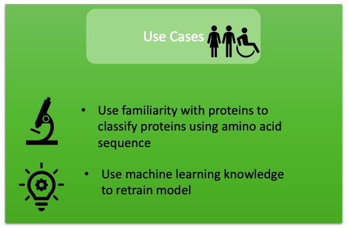

# Project TBD [Tau Be Damned]

The project TBD [Tau Be Damned] aims to use the amino acid sequence of a protein to identify whether it is disordered.

## Project Objective

Our goal is to build a tool to identify whether a protein is disordered based on its amino acid sequence. We have collected amino acid
sequences for ordered and disordered proteins from publicly available datasets to train a machine learning model to perform the
classification task.

## Mission

We share an interest in proteins.
While many proteins fold into regular conformations which can be easily analyzed on a structural basis, intrinsically disordered proteins
(IDPs) do not. IDPs like tau are implicated in diseases such as Alzheimer's and other neurodegenerative diseases. We aim to employ machine learning tools to improve the study of IDPs for scientific researchers and citizen scientists alike.

## Requirements

Package TBD has the following major dependencies:

1. python = 3.6
2. tensorflow = 2.4
3. scikit-learn = 0.23
4. scipy = 1.5
5. pandas = 1.1

The detailed list of dependencies can be found in the [environment.yml](environment.yml) file.

## Installation

The package TBD can be installed with the following steps:

1. Download the repository: <code>git clone https://github.com/Intrinsically-Disordered/TBD.git</code>
2. Go to the root directory:  <code>cd TBD</code>
3. Create a virtual environment: <code>conda env create --name tbdenv -f environment.yml</code>
4. Activate the environment: <code>conda activate tbdenv</code>
5. Install the package: <code>python setup.py install</code>
6. Check installation run: <code>python -c "import tbd"</code>

## Usage

An example to run the whole pipeline of data processing, modeling and prediction using a single script can be found here: [run_tbd.py](doc/examples/run_tbd.py)

An example to predict with the pretrained model can be found here: [example notebook](doc/examples/example_of_how_to_predict_with_package.ipynb)

## Use Cases

This project aims to be of use to the general public with interest in learning about classifying proteins, scientists determining if the protein they are working with or designed is disordered, and by those with experience in machine learning.

## Modules Overview

* __preprocessing.py__         :  Functions related to data cleaning and data processing to be ready for modeling.
* __model.py__        :  Functions related to modeling of convolutional neural network (CNN).
* __predict.py__      :  Functions related to predicting whether protein sequences are ordered or disordered using trainedmodel.
* __evaluate.py__   :  Functions related to evaluting the trained model.
* __utils.py__   :  Utility functions that can be used by other modules.

## Community Guidelines

 We welcome the members of open-source community to extend the functionalities of TBD, submit feature requests and report bugs.

 ### Feature Request:
 If you would like to suggest a feature or start a discussion on possible extension of TBD, please feel free to <a href="https://github.com/Intrinsically-Disordered/TBD/issues/new">raise an issue</a>.

 ### Bug Report:
 If you would like to report a bug, please follow <a href="https://github.com/Intrinsically-Disordered/TBD/issues/new">this link</a>.

 ### Contributions:
 If you would to contribute to TBD, you can fork the repository, add your contribution and generate a pull request. The complete guide to make contributions can be found at this <a href="https://github.com/Intrinsically-Disordered/TBD/blob/main/CONTRIBUTIONS.md">link</a>

 ## Acknowledgements

This software has been created for CSE 583 under the guidance of Professor David Beck and Anant Mittal from the University of Washington. We thank them for their technical expertise and oversight in helping to make this project a reality.
